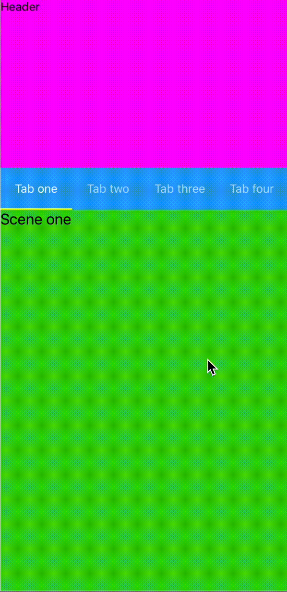

# Reanimated Tab View

> **Note**: This is a fork of [adithyavis/reanimated-tab-view](https://github.com/adithyavis/reanimated-tab-view) with additional features for custom TabBar rendering and improved customization options.

A custom Tab View component implemented using [`react-native-reanimated`](https://github.com/software-mansion/react-native-reanimated/) and [`react-native-gesture-handler`](https://github.com/software-mansion/react-native-gesture-handler/). Props are almost entirely inter-compatible with [`react-native-tab-view`](https://github.com/satya164/react-native-tab-view)

- The [example/](https://github.com/mstfmedeni/reanimated-tab-view/tree/main/example) folder contains reference code to use the library.

## Fork Features

This fork adds the following features on top of the original package:

- **renderTabBarItem**: Full control over individual tab item rendering with `TabBarItem` component
- **contentContainerStyle**: Style the inner TabBar container for both scrollable and non-scrollable modes
- **Backward compatible renderTabBar**: Support renderTabBar at root level in TabView
- **Auto-scroll improvements**: Fixed negative scroll offset issues on initial render
- **Enhanced TabBar customization**: Add badges, custom styles, and layouts to tabs

For the original package, see [adithyavis/reanimated-tab-view](https://github.com/adithyavis/reanimated-tab-view).

## Demo

<a href="https://github.com/adithyavis/reanimated-tab-view/raw/main/assets/assets_demo.mp4"></a>

## Features

reanimated-tab-view provides the following features that are provided by react-native-tab-view

- Smooth animations and gestures
- Scrollable tabs
- Supports both top and bottom tab bars
- Follows Material Design spec
- Highly customizable
- Fully typed with [TypeScript](https://typescriptlang.org)

Additionally, reanimated-tab-view also provides the following features

- Collapsible headers

  

- 3 render modes to render the tab view ("all", "windowed" and "lazy"). Can be modified using the `renderMode` prop.

  - All render mode renders all the scenes in one go, during the initial tab view mount. When the number of scenes is large, it is recommended to use the window mode/lazy mode. This is the default render mode.
  - Windowed render mode renders a window of scenes, including the current scene and the scenes adjascent to it. It is recommended to use this render mode when the number of scenes is large but when the render cost of each scene is not high.
  - Lazy render mode renders the scenes one by one when they are first mounted to the view. It is recommended to use this render mode when the number of scenes is large and when the render cost of each scene is high.

- Dynamic widths for tabs, based on the tab title length. For eg., if the tab title is "Tab one", the width of the tab will be smaller than if the tab title is "Tab hundred one". Can be modified using the `tabBarDynamicWidthEnabled` prop.

  - This feature is in accordance with the Material Design spec.
  - By default, this feature is enabled when the `tabBarType` prop is set to `'primary'`.

    

- Customisable jump-to animations (smooth jump or scroll jump). Can be modified using the `jumpMode` prop.

  - Scrolling jump: When jumped from tab one to tab four, the jump animation scrolls through the scenes in between (scenes of tab two and tab three). In case the scenes in between haven't been already rendered (while using lazy/windowed render modes), the jump-to animation will result in a momentary blank splash.
  - Smooth jump: When jumped from tab one to tab four, the jump animation smoothly animates to the target scene of tab four without scrolling through the scenes in between. This helps prevent blank splashes when using lazy/windowed render modes. This is enabled by default.
  - No animation: When jumped from tab one to tab four, the jump animation does not animate to the target scene of tab four. This is useful when you want to jump to a scene without any animation.

    |                   Smooth Jump                    |                   Scroll Jump                    |
    | :----------------------------------------------: | :----------------------------------------------: |
    |  |  |

> #### Upcoming features
>
> - Accessibility
> - RTL support

## Motivation

1.  The original react-native-tab-view is an amazing package, no doubt. However,
    it is dependent on [`react-native-pager-view`](https://github.com/callstack/react-native-pager-view).
    This dependency complicates solving issues such as

- [`TabView tab index not really controlled`](https://github.com/react-navigation/react-navigation/issues/11412)
- [`Tab label aligning vertically in some devices when render single tab.`](https://github.com/react-navigation/react-navigation/issues/11083)
- [`Screen getting stuck when switching between the tabs while keyboard opened.`](https://github.com/react-navigation/react-navigation/issues/11301).

reanimated-tab-view depends purely on react-native-reanimated, and as such, the above issues won't be encountered.

2.  The swipe and jump-to behaviors in reanimated-tab-view are more controllable. Our implementation of the swipe and jump-to behaviors are built from scratch using the animation and gesture primitives offered by react-native-reanimated and react-native-gesture-handler.

3.  We can't have collapsible headers in the original react-native-tab-view.

## Installation

Install react-native-reanimated (>=3.x) and react-native-gesture-handler (>=2.x).

- https://docs.swmansion.com/react-native-reanimated/docs/fundamentals/getting-started
- https://docs.swmansion.com/react-native-gesture-handler/docs/fundamentals/installation

Open a Terminal in the project root and run:

```sh
# Using yarn
yarn add @mstfmedeni/reanimated-tab-view

# Using npm
npm install @mstfmedeni/reanimated-tab-view
```

## Quick Start

### Basic Usage

```js
import * as React from 'react';
import { View, useWindowDimensions } from 'react-native';
import { TabView } from '@mstfmedeni/reanimated-tab-view';

const FirstRoute = () => (
  <View style={{ flex: 1, backgroundColor: '#ff4081' }} />
);

const SecondRoute = () => (
  <View style={{ flex: 1, backgroundColor: '#673ab7' }} />
);

const renderScene = ({ route }) => {
  switch (route.key) {
    case 'first':
      return <FirstRoute />;
    case 'second':
      return <SecondRoute />;
    default:
      return null;
  }
};

export default function TabViewExample() {
  const layout = useWindowDimensions();

  const [index, setIndex] = React.useState(0);
  const [routes] = React.useState([
    { key: 'first', title: 'First' },
    { key: 'second', title: 'Second' },
  ]);

  return (
    <TabView
      navigationState={{ index, routes }}
      renderScene={renderScene}
      onIndexChange={setIndex}
      initialLayout={{ width: layout.width }}
    />
  );
}
```

### Custom Tab Bar with renderTabBarItem

```js
import * as React from 'react';
import { View } from 'react-native';
import { TabView, TabBar, TabBarItem } from '@mstfmedeni/reanimated-tab-view';

const renderCustomTabBar = (props) => (
  <TabBar
    {...props}
    contentContainerStyle={{ justifyContent: 'flex-start', gap: 8 }}
    renderTabBarItem={(tabProps) => (
      <View>
        <TabBarItem
          {...tabProps}
          activeColor="#007AFF"
          inactiveColor="#8E8E93"
          labelStyle={{
            fontSize: 14,
            fontWeight: tabProps.focused ? '600' : '400',
          }}
          style={{
            borderRadius: 8,
            paddingHorizontal: 16,
            paddingVertical: 8,
            backgroundColor: tabProps.focused ? '#E5F1FF' : 'transparent',
          }}
        />
        {/* Add badge */}
        {tabProps.index === 0 && (
          <View
            style={{
              position: 'absolute',
              top: -4,
              right: -4,
              width: 8,
              height: 8,
              borderRadius: 4,
              backgroundColor: '#FF3B30',
            }}
          />
        )}
      </View>
    )}
    style={{ backgroundColor: '#F2F2F7' }}
    indicatorStyle={{ height: 0 }}
  />
);

export default function CustomTabBarExample() {
  // ... same as basic example
  return (
    <TabView
      navigationState={{ index, routes }}
      renderScene={renderScene}
      onIndexChange={setIndex}
      renderTabBar={renderCustomTabBar}
      tabBarConfig={{
        tabBarDynamicWidthEnabled: true,
      }}
    />
  );
}
```

## Props

| Name                   | Description                                                                                                                                                       | Required | Type                                                     | Default   |
| ---------------------- | ----------------------------------------------------------------------------------------------------------------------------------------------------------------- | -------- | -------------------------------------------------------- | --------- |
| navigationState        | The state of the navigation including the index and routes.                                                                                                       | Yes      | `{index: number; routes: Route;}`                        |           |
| renderScene            | A function that renders the scene for a given route. Use `RTVScrollView` or `RTVFlatList` in order to render collapsible headers through the `renderHeader` prop. | Yes      | `(props: SceneRendererProps) => React.ReactNode`        |           |
| onIndexChange          | A function that is called when the index changes.                                                                                                                 | Yes      | `(index:number) => void`                                 |           |
| renderTabBar           | Custom function to render the tab bar. Can be provided at root level or in `tabBarConfig`.                                                                        | No       | `(props: TabBarProps) => React.ReactNode`                | undefined |
| initialLayout          | The initial layout of the tab view.                                                                                                                               | No       | `Partial<{width: number; height: number;}>`              | undefined |
| sceneContainerStyle    | The style for the scene container.                                                                                                                                | No       | `StyleProp<Animated.AnimateStyle<StyleProp<ViewStyle>>>` | undefined |
| sceneContainerGap      | The gap between each scene.                                                                                                                                       | No       | Number                                                   | 0         |
| keyboardDismissMode    | Specifies how to dismiss the keyboard.                                                                                                                            | No       | `'auto'\|'on-drag'\|'none'`                              | 'auto'    |
| animatedRouteIndex     | A callback equivalent. Pass a shared value and its value gets updated when tab view is swipeds                                                                    | No       | `SharedValue<number>`                                    | undefined |
| swipeEnabled           | Enables or disables swipe gestures.                                                                                                                               | No       | Boolean                                                  | true      |
| renderMode             | Specifies the layout mode of the tab view.                                                                                                                        | No       | `'windowed'\|'lazy'\|'all'`                              | "all"     |
| jumpMode               | Specifies the jump mode of the tab view.                                                                                                                          | No       | `'smooth'\|'scrolling'\|'no-animation'`                  | "smooth"  |
| tabBarConfig           | Configuration for the tab bar.                                                                                                                                    | No       | `TabBarConfig`- For details, see below.                  | undefined |
| renderHeader           | A function that renders the header for the tab view.                                                                                                              | No       | `(props: HeaderRendererProps) => React.ReactNode`         | undefined |
| onSwipeEnd             | Callback function for when a swipe gesture ends.                                                                                                                  | No       | Function                                                 | undefined |
| onSwipeStart           | Callback function for when a swipe gesture starts.                                                                                                                | No       | Function                                                 | undefined |

### TabBarConfig Properties

| Name                      | Description                                                                | Required | Type                                                     | Default                                               |
| ------------------------- | -------------------------------------------------------------------------- | -------- | -------------------------------------------------------- | ----------------------------------------------------- |
| tabBarPosition            | Specifies the position of the tab bar.                                     | No       | `'top'\|'bottom'`                                        | 'top'                                                 |
| tabBarType                | Specifies the type of the tab bar, according to the Material Design spec.  | No       | `'primary'\|'secondary'`                                 | 'secondary'                                           |
| tabBarScrollEnabled       | Enables or disables scrollable tab bar.                                    | No       | Boolean                                                  | false                                                 |
| tabBarDynamicWidthEnabled | Enables dynamic width for tabs.                                            | No       | Boolean                                                  | true for primary tab bar, false for secondary tab bar |
| scrollableTabWidth        | The width of each tab. Applicable ONLY when `tabBarScrollEnabled` is true. | No       | Number                                                   | 100                                                   |
| tabBarStyle               | Used to modify the style for the tab bar container.                        | No       | `StyleProp<ViewStyle>`                                   | undefined                                             |
| tabStyle                  | Used to modify the style for each tab.                                     | No       | `StyleProp<ViewStyle>`                                   | undefined                                             |
| tabLabelStyle             | Used to modify the style for tab labels.                                   | No       | `StyleProp<TextStyle>`                                   | undefined                                             |
| tabBarIndicatorStyle      | Used to modify the style for the tab bar indicator.                        | No       | `StyleProp<ViewStyle>`                                   | undefined                                             |
| renderTabBar              | Custom method to render the tab bar.                                       | No       | `(props: TabBarProps) => React.ReactNode`                | undefined                                             |

### TabBar Component Props

When using the `TabBar` component directly (via `renderTabBar`), you have access to these additional props:

| Name                   | Description                                                                                   | Type                                              | Default   |
| ---------------------- | --------------------------------------------------------------------------------------------- | ------------------------------------------------- | --------- |
| renderTabBarItem       | Custom function to render each tab item. Provides full control over tab appearance.           | `(props: TabBarItemProps) => React.ReactNode`     | undefined |
| contentContainerStyle  | Style for the inner container (FlatList contentContainerStyle or View style).                 | `StyleProp<ViewStyle>`                            | undefined |
| activeColor            | Color for active tab labels.                                                                  | String                                            | undefined |
| inactiveColor          | Color for inactive tab labels.                                                                | String                                            | undefined |
| getLabelText           | Function to get label text from route.                                                        | `(scene: Scene) => string \| undefined`           | undefined |
| tabContentStyle        | Style for tab content container.                                                              | `StyleProp<ViewStyle>`                            | undefined |
| onTabPress             | Callback when a tab is pressed.                                                               | `(scene: Scene) => void`                          | undefined |
| onTabLongPress         | Callback when a tab is long pressed.                                                          | `(scene: Scene) => void`                          | undefined |

### TabBarItem Component Props

The `TabBarItem` component can be used with `renderTabBarItem`:

| Name           | Description                          | Type                       | Default   |
| -------------- | ------------------------------------ | -------------------------- | --------- |
| route          | The route object (provided by hook). | Route                      | -         |
| focused        | Whether the tab is focused.          | Boolean                    | -         |
| index          | The tab index.                       | Number                     | -         |
| activePercentage | Animation value for transitions.   | `SharedValue<number>`      | -         |
| activeColor    | Color for active state.              | String                     | undefined |
| inactiveColor  | Color for inactive state.            | String                     | undefined |
| labelStyle     | Style for the label text.            | `StyleProp<TextStyle>`     | undefined |
| style          | Style for the container.             | `StyleProp<ViewStyle>`     | undefined |
| label          | Custom label text.                   | String                     | undefined |

### Ref Methods

- `jumpTo(routeKey: string)`: Jump to a specific route.

## API Examples

### Using contentContainerStyle

Control the layout and spacing of tabs:

```js
<TabBar
  {...props}
  contentContainerStyle={{
    justifyContent: 'flex-start',  // Align tabs to start
    gap: 12,                        // Add spacing between tabs
    paddingHorizontal: 16,          // Add horizontal padding
  }}
  tabBarConfig={{
    tabBarDynamicWidthEnabled: true, // Let tabs size to content
  }}
/>
```

### Custom Tab Items with Badges

```js
renderTabBarItem={(tabProps) => (
  <View>
    <TabBarItem
      {...tabProps}
      style={{
        borderRadius: 20,
        paddingHorizontal: 16,
        paddingVertical: 8,
        backgroundColor: tabProps.focused ? '#007AFF' : '#F0F0F0',
      }}
    />
    {/* Notification badge */}
    {tabProps.route.badge && (
      <View style={styles.badge}>
        <Text style={styles.badgeText}>{tabProps.route.badge}</Text>
      </View>
    )}
  </View>
)}
```

### Backward Compatibility

Both ways of providing `renderTabBar` are supported:

```js
// Option 1: Root level (new, recommended)
<TabView
  renderTabBar={renderCustomTabBar}
  {...otherProps}
/>

// Option 2: In tabBarConfig (legacy, still supported)
<TabView
  tabBarConfig={{
    renderTabBar: renderCustomTabBar,
  }}
  {...otherProps}
/>
```

## Author

- [Adithya Viswamithiran](https://github.com/adithyavis/)

## License

[MIT](./LICENSE)
